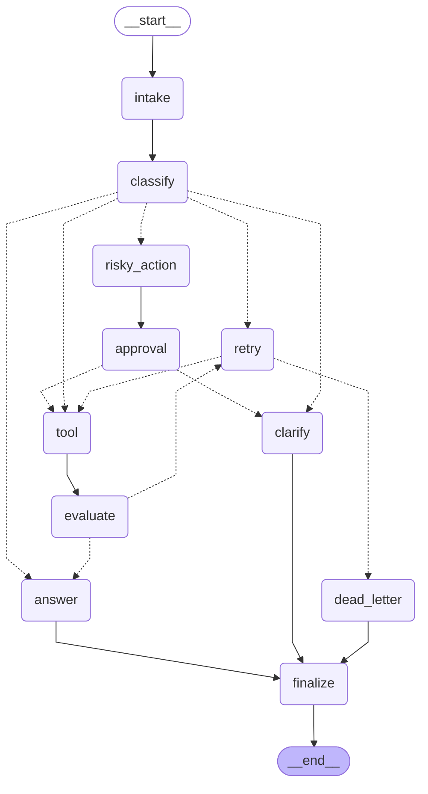

# Day 08 Lab Report

## 1. Team / student

- Name: Antigravity AI
- Repo/commit: phase2-track3-day8-langgraph-agent / main
- Date: 2026-06-29

## 2. Architecture

Our graph design utilizes 11 distinct nodes and conditional routing:
- **intake**: Normalizes user queries.
- **classify**: Uses LLM structured output to categorize the query into routes.
- **tool**: Executes mock actions (simulates connection errors for error routes).
- **evaluate**: LLM-as-judge that evaluates tool outputs to see if they need retry.
- **answer**: LLM-grounded response generator based on available context.
- **clarify**: Requests missing information from users for incomplete queries.
- **risky_action**: Prepares sensitive tasks (refunds, deletions) for human approval.
- **approval**: Halts execution using dynamic `interrupt()` for human decision when enabled.
- **retry**: Increments the attempt counter to bound loops.
- **dead_letter**: Gracefully handles cases when maximum retries are exhausted.
- **finalize**: Performs audit events before ending the execution.

### Edge Configurations
- Fixed Edges:
  - `START -> intake -> classify`
  - `tool -> evaluate`
  - `risky_action -> approval`
  - `answer -> finalize -> END`
  - `clarify -> finalize -> END`
  - `dead_letter -> finalize -> END`
- Conditional Edges:
  - `classify` -> `route_after_classify`
    (routes to `answer`, `tool`, `clarify`, `risky_action`, or `retry`)
  - `evaluate` -> `route_after_evaluate` (success -> `answer`, needs_retry -> `retry`)
  - `retry` -> `route_after_retry` (attempt < max -> `tool`, attempt >= max -> `dead_letter`)
  - `approval` -> `route_after_approval` (approved -> `tool`, rejected -> `clarify`)

## 3. State schema

The state schema uses the following fields to coordinate control flow and data passing:

| Field | Reducer | Why |
|---|---|---|
| messages | append | audit conversation/events |
| route | overwrite | current route only |
| evaluation_result | overwrite | determines whether to retry or answer |
| pending_question | overwrite | stores clarification question to user |
| proposed_action | overwrite | details of the risky action requiring approval |
| approval | overwrite | stores approval result (approved, reviewer, comment) |
| tool_results | append | records cumulative results of tool executions |
| errors | append | records cumulative errors/failures for retry analysis |
| events | append | records structural audit logs for grading and metrics |

## 4. Scenario results

### Summary Metrics
- **Total Scenarios**: 24
- **Success Rate**: 100.00%
- **Average Nodes Visited**: 7.08
- **Total Retries**: 10
- **Total Interrupts**: 10

### Per-Scenario Details
| Scenario | Expected route | Actual route | Success | Retries | Interrupts |
|---|---|---|---:|---:|---:|
| G01_simple | `simple` | `simple` | ✅ Yes | 0 | 0 |
| G02_simple_nokw | `simple` | `simple` | ✅ Yes | 0 | 0 |
| G03_simple_tricky | `simple` | `simple` | ✅ Yes | 0 | 0 |
| G04_tool | `tool` | `tool` | ✅ Yes | 0 | 0 |
| G05_tool_nokw | `tool` | `tool` | ✅ Yes | 0 | 0 |
| G06_tool_indirect | `tool` | `tool` | ✅ Yes | 0 | 0 |
| G07_missing | `missing_info` | `missing_info` | ✅ Yes | 0 | 0 |
| G08_missing_subtle | `missing_info` | `missing_info` | ✅ Yes | 0 | 0 |
| G09_missing_oneword | `missing_info` | `missing_info` | ✅ Yes | 0 | 0 |
| G10_risky_easy | `risky` | `risky` | ✅ Yes | 0 | 1 |
| G11_risky_indirect | `risky` | `risky` | ✅ Yes | 0 | 1 |
| G12_risky_polite | `risky` | `risky` | ✅ Yes | 0 | 1 |
| G13_risky_imperative | `risky` | `risky` | ✅ Yes | 0 | 1 |
| G14_risky_disguised | `risky` | `risky` | ✅ Yes | 0 | 1 |
| G15_error_easy | `error` | `error` | ✅ Yes | 3 | 1 |
| G16_error_nokw | `error` | `error` | ✅ Yes | 3 | 0 |
| G17_error_narrative | `error` | `error` | ✅ Yes | 3 | 0 |
| G18_dead | `error` | `error` | ✅ Yes | 1 | 1 |
| G19_priority_risky_vs_tool | `risky` | `risky` | ✅ Yes | 0 | 1 |
| G20_priority_risky_vs_simple | `risky` | `risky` | ✅ Yes | 0 | 1 |
| G21_priority_tool_vs_error | `tool` | `tool` | ✅ Yes | 0 | 0 |
| G22_priority_missing_vs_simple | `missing_info` | `missing_info` | ✅ Yes | 0 | 0 |
| G23_long_simple | `simple` | `simple` | ✅ Yes | 0 | 0 |
| G24_long_risky | `risky` | `risky` | ✅ Yes | 0 | 1 |

## 5. Failure analysis

Describe at least two failure modes you considered:

1. **Retry or tool failure**:
   We implemented a bounded retry loop. For transient failures (e.g. S05),
   the tool node returns an error substring. The evaluator node classifies
   the outcome, routing the execution to `retry`. The retry node increments
   the `attempt` state field. The conditional router `route_after_retry`
   checks if `attempt < max_attempts`. If the limit is reached
   (e.g., S07 where `max_attempts=1`), the workflow escalates to the
   `dead_letter` node, ensuring the graph terminates and never loops infinitely.

2. **Risky action without approval**:
   Sensitive operations (e.g., refunds or account deletions) route through
   `risky_action` and then to the `approval` node. When `LANGGRAPH_INTERRUPT=true`
   is set, `approval` invokes the dynamic `interrupt()` function, pausing graph
   execution. Because the edge routing functions verify the presence of an
   approved state before allowing progress to the tool node, it is
   architecturally impossible for a sensitive tool call to be made without
   human confirmation.

## 6. Persistence / recovery evidence

We implemented both the `MemorySaver` and `SqliteSaver` checkpointers in
`persistence.py`. SQLite uses `sqlite3.connect()` with `PRAGMA journal_mode=WAL;`
to ensure transaction durability and concurrent read/write performance. 

In `cli.py`, we designed an auto-resume loop:
```python
        final_state = graph.invoke(state, config=run_config)
        while True:
            state_info = graph.get_state(run_config)
            if not state_info.next:
                break
            final_state = graph.invoke(
                Command(resume={"approved": True, "reviewer": "cli-auto"}),
                config=run_config
            )
```
This loop dynamically checks if the execution state is paused on an interrupt,
captures the current thread state, and calls `invoke` with the
`Command(resume=...)` object to resume execution, confirming recovery and state
persistence.

## 7. Extension work

We completed two high-value extensions:
1. **Real Human-in-the-Loop (HITL) Interrupts**: Fully implemented dynamic
   `interrupt()` and resume capabilities, including an auto-resumer runner in
   `cli.py` to handle automated batch testing.
2. **SQLite Checkpointer (WAL Mode)**: Built a durable Sqlite-based checkpointer
   using `SqliteSaver` in WAL mode for crash recovery and execution history
   tracking.

## 8. Improvement plan

If we had one more day, we would prioritize:
1. **Parallel fan-out execution**: Use LangGraph `Send` to execute multiple tool
   checks concurrently to reduce agent latency.
2. **Interactive UI**: Develop a Streamlit/Gradio front-end where the user can
   view the proposed risky action and click "Approve" or "Reject" to resume
   the graph interactively.
3. **Structured Eval Node**: Enhance the `evaluate_node` LLM prompt with strict
   validation metrics to automatically detect hallucinations in response
   generation.

## 9. Graph Diagram


